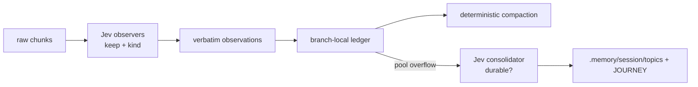

# pi-observational-memory-jev

Tiered observational memory for [pi](https://github.com/badlogic/pi-mono), with [Jev](https://typesafe.ai/blog/introducing-system-one-models-and-jev) as the observation backend.

The slash commands, clocks, ledger, footer gauges, and `.memory/<session>/` layout match [Eero Alvar's observational-memory extension](https://github.com/amosblomqvist/pi-observational-memory). The observer is not a chat-model pi subprocess. It is TypeSafe Jev.

## Why

Long coding sessions lose the evidence that later turns need: the constraint the user stated, the error that already happened, the decision that replaced an earlier one. The usual fix is to ask a language model to *summarise*. Summaries are lossy and unstructured. A file path, an exact error, or a prohibition can vanish inside a paragraph, and compaction then has to trust that paragraph.

Observational memory attacks that a different way. Raw history is cut into token-bounded chunks. Each chunk is distilled into atomic observations on a branch-local ledger. Compaction is then a **deterministic, model-free render** of that ledger plus durable topic files. `/tree` rolls the short-term buffer back with the branch; spend and topic files do not.

Jev is the right observer for that pipeline because it is **not a chat model**. It takes unstructured state plus typed questions and returns typed decisions with confidence. This extension never asks it to rewrite the transcript:

1. Cut the chunk into labelled **verbatim candidates**.
2. Ask Jev, in one or a few fast requests, whether each candidate should be kept and what kind it is (`fact`, `decision`, `constraint`, `question`, `correction`, `hypothesis`).
3. Store the original text with those scores. Compaction prints the ledger as-is.

That is the same "never rewrite, only decide" rule [Tamara Tran applied to Claude Code compaction](https://github.com/tamaratran/fast-jev-compaction), applied to pi's observational-memory ergonomics. Structured observations are what make compaction fast: no second language-model summary, no subprocess pi, no waiting on prose.

Jev cannot invent topic names either. The consolidator asks one more keep/drop question, then the coordinator appends surviving lines into kind-keyed files (`decisions.md`, `constraints.md`, …) and a bounded `JOURNEY.md`. Tombstones are written only after those files land, so a failed Jev call does not drain the buffer.

Do not add Jev to `~/.pi/agent/models.json`. System One is not a chat-completions API; this extension calls `https://api.typesafe.ai/v1/systemone` directly.

Do not install this alongside Alvar's original `/om` extension. The commands collide.

## On/off gate (default OFF)

The extension is invisible until you turn it on for the current session.

- `/om` — toggle
- `/om on` / `/om off` — set explicitly

State persists in the ledger (`om.enabled`) and survives resume.

## How it works



- **Observer clock** (`turn_end` / `agent_start`): every `chunkTokens` of new raw history, fire an in-process Jev observer (capped by `observerConcurrency`). Empty chunks still commit a coverage watermark so resume does not re-observe them.
- **Observation** = `{ timestamp, content, kind, keep, tokenCount }`. `content` is a single-line excerpt from the chunk. The orchestrator owns the unique timestamp id.
- **Compaction** (`session_before_compact`, also auto at `compactAtContextTokens`): wait for observers that can affect the cutoff, snap the cutoff to a chunk boundary, render journey + memory map + observations. If that render is empty, pi's default compaction runs instead.
- **Consolidator clock**: when the active pool exceeds `consolidateAtPoolTokens`, promote the oldest observations above `poolTargetTokens` into `.memory/<sessionId>/`. Topic files and `JOURNEY.md` are **not** rolled back by `/tree`. A fork seeds its directory from the parent once.

## Commands

| Command | Effect |
|---|---|
| `/om`, `/om on`, `/om off` | Per-session on/off gate |
| `/om:status` | Workers, pool, clocks, Jev endpoint, last error |
| `/om:compact` | Force compaction now |
| `/om:consolidate` | Force consolidation now |

Footer gauges (when on): observer progress `O`, consolidator pool `C`, context `X`, plus session cost.

## Setup

1. Create a TypeSafe account and API key at [typesafe.ai](https://typesafe.ai).
2. Export it in the environment that launches pi (never commit it):

```sh
export TYPESAFE_API_KEY=...
```

3. Install the package:

```sh
pi install git:github.com/willfish/pi-observational-memory-jev
```

Or, from a checkout:

```sh
pi -e ./src/index.ts
```

4. Optional settings in `~/.pi/agent/settings.json` or `.pi/settings.json`:

```jsonc
{
  "observational-memory-jev": {
    "chunkTokens": 10000,
    "poolTargetTokens": 10000,
    "consolidateAtPoolTokens": 15000,
    "compactAtContextTokens": 150000,
    "tailTokens": 20000,
    "journeyTargetTokens": 1000,
    "observerConcurrency": 4,
    "jev": {
      "model": "jev-latest",
      "baseUrl": "https://api.typesafe.ai/v1/systemone",
      "apiKeyEnv": "TYPESAFE_API_KEY",
      "keepThreshold": 0.5
    }
  }
}
```

`PI_OM_PASSIVE=1` disables triggers without flipping the on/off gate.

## Development

```sh
npm install
npm test
npm run typecheck
```

Unit tests use a fake Jev and never contact TypeSafe.

## Credit

Ergonomics and ledger design follow [amosblomqvist/pi-observational-memory](https://github.com/amosblomqvist/pi-observational-memory). The Jev keep/drop pattern follows [tamaratran/fast-jev-compaction](https://github.com/tamaratran/fast-jev-compaction).
