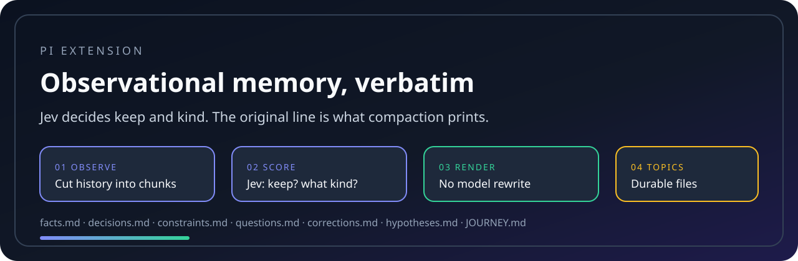
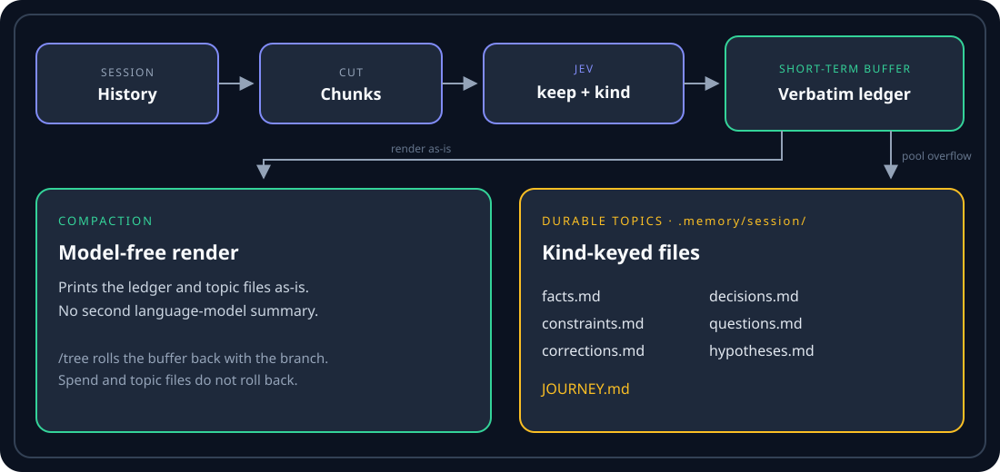

<div align="center">

# pi-observational-memory-jev

**Jev decides what to keep. Compaction never rewrites the transcript.**


[](docs/diagrams/hero.svg)

`/om on` -> chunk history -> Jev keep/kind -> verbatim ledger -> model-free compact, durable topics.

</div>

---

## Why This Exists

Long coding sessions lose the evidence later turns need: the constraint the
user stated, the error that already happened, the decision that replaced an
earlier one.

The usual fix is to ask a language model to summarise. Summaries are lossy. A
file path, an exact error, or a prohibition can vanish inside a paragraph, and
compaction then has to trust that paragraph.

This extension never rewrites the transcript. It cuts history into chunks, asks
[Jev](https://typesafe.ai/blog/introducing-system-one-models-and-jev) only
keep/kind questions, and stores the original line. Compaction is a
deterministic render of that ledger plus durable topic files.

| Step | What Jev answers |
| --- | --- |
| Observe | Keep this candidate? What kind is it? |
| Consolidate | Promote it into a durable topic file? |

Jev is not a chat model. Do not add it to `~/.pi/agent/models.json`. This
extension calls `https://api.typesafe.ai/v1/systemone` directly.

Do not install this alongside [Alvar's original `/om` extension](https://github.com/amosblomqvist/pi-observational-memory). The commands collide.

The slash commands, clocks, ledger, footer gauges, and `.memory/<session>/`
layout follow that original. The observer is TypeSafe Jev instead of a
chat-model pi subprocess.

## Install

1. Create a TypeSafe account and API key at [typesafe.ai](https://typesafe.ai).
2. Export it in the environment that launches pi (never commit it):

```bash
export TYPESAFE_API_KEY=...
```

3. Install the package:

```bash
pi install git:github.com/willfish/pi-observational-memory-jev
```

The extension is off until you turn it on for the current session:

```text
/om
/om on
/om off
```

State persists in the ledger (`om.enabled`) and survives resume.

<details>
<summary><strong>Local development install</strong></summary>

```bash
pi -e ./src/index.ts
```

</details>

<details>
<summary><strong>Optional settings</strong></summary>

`~/.pi/agent/settings.json` or `.pi/settings.json`:

```jsonc
{
  "observational-memory-jev": {
    "chunkTokens": 10000,
    "poolTargetTokens": 10000,
    "consolidateAtPoolTokens": 15000,
    "compactAtContextTokens": 150000,
    "tailTokens": 20000,
    "journeyTargetTokens": 1000,
    "observerConcurrency": 4,
    "jev": {
      "model": "jev-latest",
      "baseUrl": "https://api.typesafe.ai/v1/systemone",
      "apiKeyEnv": "TYPESAFE_API_KEY",
      "keepThreshold": 0.5
    }
  }
}
```

`PI_OM_PASSIVE=1` disables clocks without flipping the on/off gate.

</details>

## Commands

| Command | Effect |
| --- | --- |
| `/om`, `/om on`, `/om off` | Per-session on/off gate (default off) |
| `/om:status` | Workers, pool, clocks, Jev endpoint, last error |
| `/om:compact` | Force compaction now |
| `/om:consolidate` | Force consolidation now |

Footer gauges when on: observer progress `O`, consolidator pool `C`, context
`X`, plus session cost.

## How It Works



Compaction prints lines like this, not a rewritten paragraph:

```text
2026-03-18T16:02:11Z  [constraint] Rails app code must not explicitly require autoloadable constants
2026-03-18T16:41:08Z  [decision] Use direnv exec for this checkout rather than a global Node
2026-03-18T17:05:44Z  [correction] The failing spec was a factory default, not the calculator
```

| Rolled back by `/tree` | Not rolled back |
| --- | --- |
| Short-term observation buffer | Topic files, `JOURNEY.md`, spend |

Kinds are fixed. Jev cannot invent topic names. Surviving lines land in
kind-keyed files under `.memory/<session>/`:

| File | Kind |
| --- | --- |
| `facts.md` | Concrete assertion about the work so far |
| `decisions.md` | Choice that should not be silently reversed |
| `constraints.md` | Rule, prohibition, or requirement |
| `questions.md` | Unresolved question |
| `corrections.md` | Later statement that replaces an earlier one |
| `hypotheses.md` | Tentative claim, not yet confirmed |
| `JOURNEY.md` | Bounded orientation only, not a plan |

Tombstones are written only after those files land, so a failed Jev call does
not drain the buffer. A forked session seeds its directory from the parent
once.

## Requirements

| Tool | Used for |
| --- | --- |
| [pi](https://github.com/badlogic/pi-mono) | Host agent and extension API |
| `TYPESAFE_API_KEY` | Jev / System One observer and consolidator |

## Development

```bash
npm install
npm test
npm run typecheck
```

Unit tests use a fake Jev and never contact TypeSafe.

## Troubleshooting

<details>
<summary><strong>Nothing seems to happen</strong></summary>

The gate defaults to off. Run `/om on`, then `/om:status`. Empty or already
covered chunks still advance the watermark so resume does not re-observe them.

</details>

<details>
<summary><strong>Jev errors / missing API key</strong></summary>

Export `TYPESAFE_API_KEY` in the same environment that launches pi. Do not put
Jev in `models.json`; System One is not a chat-completions API.

</details>

<details>
<summary><strong>Compaction looks like pi's default summary</strong></summary>

If the observational render is empty, pi's default compaction runs instead.
Turn the gate on earlier in the session, or run `/om:compact` after observers
have filled the ledger.

</details>

## Credit

Ergonomics and ledger design follow
[amosblomqvist/pi-observational-memory](https://github.com/amosblomqvist/pi-observational-memory).
The Jev keep/drop pattern follows
[tamaratran/fast-jev-compaction](https://github.com/tamaratran/fast-jev-compaction).
